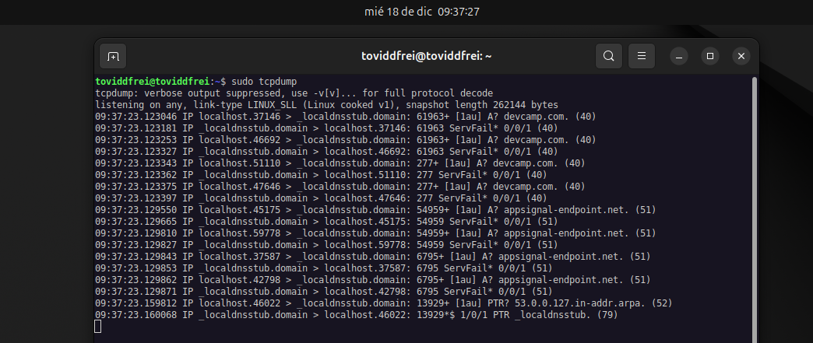

# Ejercicio de instalación y puesta en marcha de tcpdump

## Instalación en Ubuntu 24.04 de tcpdump

La instalación de tcpdump en Ubuntu 24.04 no es sencilla, sino que ya está realizada en esta distribución de Linux, esta herramienta de software viene preinstalada y preparada para usar, recordemos que para su uso es necesario tener privilegios de administrador. Por lo tanto esta lista para usar con solo escribir en nuestra consola, (recordemos que tcpdump es una herramienta para usar a traves de la consola o shell del sistema) el siguiente comando:

```bash

sudo tcpdump

```
## Ejercicio 001: Instalación y puesta en marcha de tcpdump sin conexiones de red.

Con esta sola instrucción la herramienta se pondrá en marcha y empezará a recoger todos los paquetes que transitan por la red, su origen, su destino, la hora en que ese paquete ha sido registrado y un monton de información más, la cual ire destripando muy poquito a poco. De momento tenemos la herramienta en marcha con solo dos palabras sudo y tcpdump. Hemos avanzado, ¿no?. Pues bueno, quiero realizar un primer ejercicio con esta herramienta. A ver si me podeis seguir.

Si hasta aquí tenemos claro que tenemos una herramienta que nos captura todo el tráfico de red, os voy a poner un ejemplo, supongamos que tenemos un aeropuerto sin aviones, sin transito de origen a destino, por lo tanto supongamos que no tenemos ningun tipo de conexión aplicada en nuestro equipo, ¿en teoria no tendriamos ningun trafico?

Vamos a verlo, realizamos este primer ejercicio, instalación y una vez instalado, si fuera pertinente, eliminamos todas nuestras conexiones, ya sean de wifi de cobre de datos, cualquier conexion la cerramos o la desconectamos y lanzamos la herramienta tal como hemos visto.


Si queremos tener claro el ejercicio démonos unos segundos y veamos si realmente no hay tráfico en la red, mantenemos la teoría, aunque raro será que no empiecen a transitar paquetes, ya que servicios que muchos utilizamos siempre estan realizando petiiones, servicios que sincronizan con cualquier servidor enviaran paquetes que aun sin tener conexion esperan realizar su funcion y obtienen un fallo.

Este ejercicio sería muy eficaz para ver si todo lo que transita por la red sin tener conexión, lo conocemos, le hemos dado permiso o instalado nosotros mismo y por supuesto podriamos detectar algun que otro malware que tengamos instalado sin darnos cuenta.

Os relato mi caso en concreto, tengo habilitados varios servicios de sincronización, tales como MEGA, DevCamp. Si realizo el ejercicio veo claramente que esto servicios estan activos y pendientes de poder realizar su función.

Pero me voy a tomar un tiempo para investigar todo el tráfico de mi equipo sin conexión, sería una muy buena práctica para empezar.

